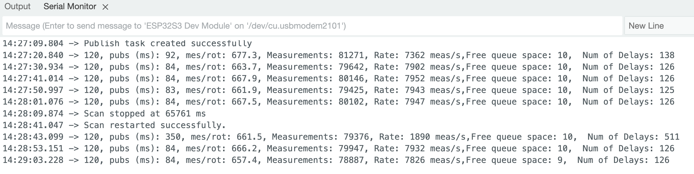

# RPLidar implementation for ESP32
This is implemented based on Slamtech's RPLidar's [implementation]( https://github.com/Slamtec/rplidar_sdk/tree/master/sdk) for Linux, MacOS, Win.
This implementation works on ESP32 without PSRAM.
It can read upto 8000 measurements per seconds without stalling.

## Why was this implemented
I looked at a few implemenentations for Arduino and ESP32 but they didn't work for one reason or another. Here are some other implementation if you prefer them.
* [SlamtecLidarESP32](https://github.com/gfvalvo/SlamtecLidarESP32) - I would like to use this but needs ESP32 with PSRAM support. It also does very few measurements per second.
* [ESP32_Arduino_RPLIDAR_S2](https://github.com/KKest/ESP-rplidarS2)
* [an arduino (ESP32) library for the rplidar](https://github.com/thijses/rplidar)
* [LiDAR Library for Arduino](https://github.com/kaiaai/LDS/tree/main)
* [rplidar_arduino](https://github.com/robopeak/rplidar_arduino/tree/master)
* [rplidar_sdk_arduino](https://github.com/GuchiEg/rplidar_sdk_arduino/tree/master)

## Whats implemented
Currently, there are the following functions implemented in the library

Start and Stop motor & scanning.
Express Scan reads from sensor at 8000 measurements per sec.
read of sensor health information
read of sensor information

## What is tested
RpLidar A1-M8 with 1.24 firmware with ESP-WROOM32, ESP-S3-WROOM-1-N16R8

## Example output
